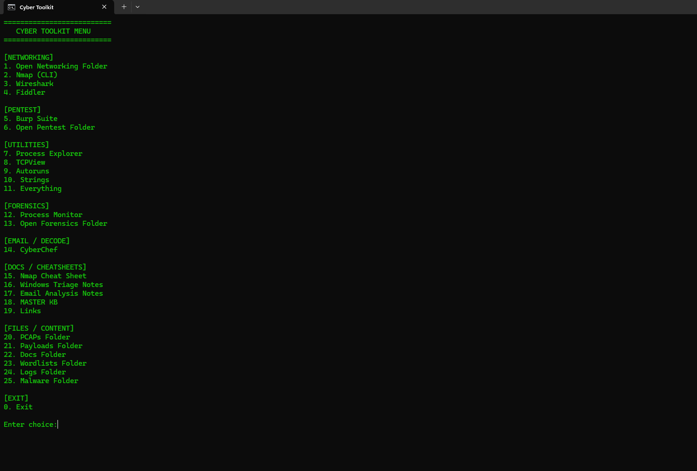

# 🔐 Cyber Toolkit Lab™

### Built by Leonard Bell Jr.

> A custom-built SOC investigation toolkit designed to simulate real-world cybersecurity workflows and incident response processes.

---

## 🚀 Version

**v1.0 – Initial Release**

---

## 📌 Overview

Cyber Toolkit Lab™ is a hands-on cybersecurity project that integrates multiple industry-standard tools into a unified workflow for Security Operations Center (SOC) analysis.

This toolkit is designed to mimic real-world investigation environments, enabling efficient triage, analysis, and response to potential security threats.

---

## 🎯 Objectives

* Build a structured SOC investigation workflow
* Gain hands-on experience with cybersecurity tools
* Improve incident response and triage skills
* Develop a professional cybersecurity portfolio

---

## 🧰 Tools Integrated

* Nmap – Network scanning and reconnaissance
* Wireshark – Packet capture and analysis
* Process Explorer – Process monitoring
* Autoruns – Persistence detection
* CyberChef – Data decoding and transformation

---

## ⚙️ Core Features

* Custom launcher for fast tool access
* Organized investigation workflow structure
* Integrated cheat sheets and knowledge base
* Dedicated folders for:

  * Logs
  * PCAPs
  * Payloads
  * Malware samples

---

## 🔁 Example SOC Workflow

1. Perform network reconnaissance using Nmap
2. Capture and inspect traffic with Wireshark
3. Analyze running processes via Process Explorer
4. Identify persistence mechanisms using Autoruns
5. Decode suspicious artifacts with CyberChef

---

## 🧰 Toolkit Interface

The custom launcher provides centralized access to all tools used during investigations.



**Capabilities:**

* Rapid tool deployment
* Streamlined investigation flow
* Improved response efficiency

---

## 🧠 Skills Demonstrated

* Network reconnaissance and analysis
* Packet inspection and traffic analysis
* Endpoint investigation techniques
* Persistence detection methods
* Threat data decoding
* SOC workflow design and execution

---

## 📂 Project Structure

```
Cyber-Toolkit-Lab/
│
├── Launch/
├── CheatSheets/
├── Screenshots/
│   └── Toolkit-menu.png
├── README.md
├── LICENSE
```

---

## 🔒 Ownership & Usage

This project was designed and developed by **Leonard Bell Jr.** as part of a cybersecurity learning and portfolio initiative.

All third-party tools referenced remain the property of their respective owners.

---

## 📈 Roadmap (Next Up)

* Add real incident investigation case study
* Include SIEM queries and detection rules
* Expand malware analysis workflows
* Automate parts of the investigation process

---

## 🧪 Incident Reports
- [Incident 1 - In Progress](Incidents/incident-1.md)

---

## 🏷️ License

This project is licensed under the MIT License.

---

## 💼 Author

**Leonard Bell Jr.**
Aspiring SOC Analyst | Cybersecurity Enthusiast


